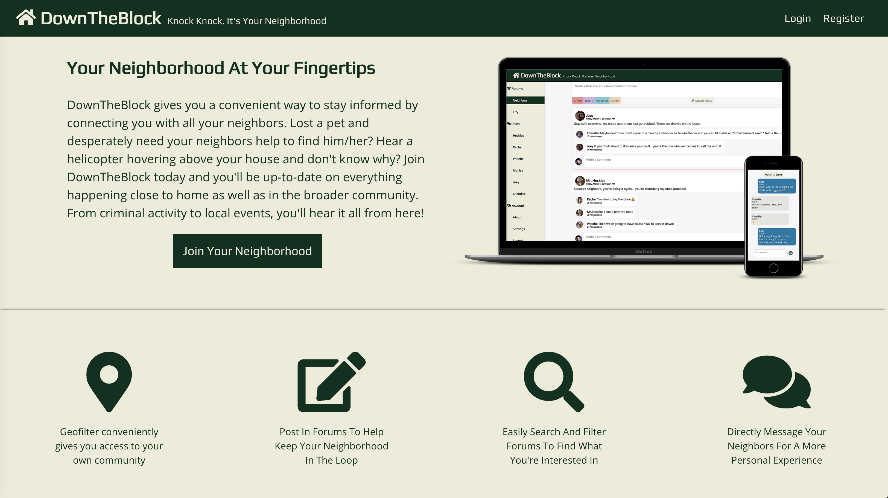
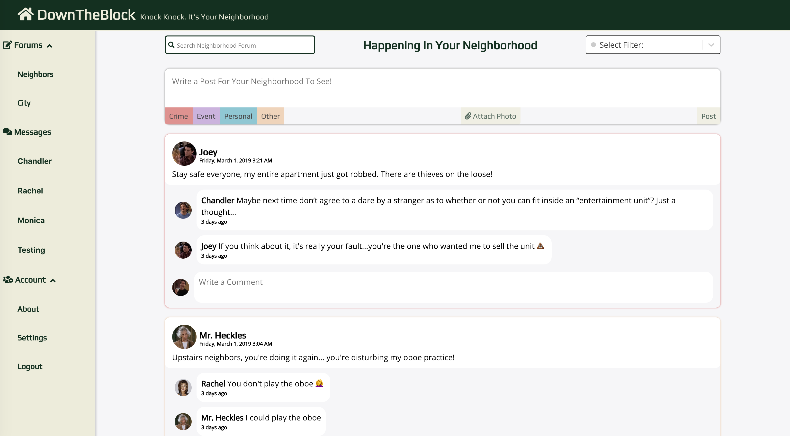
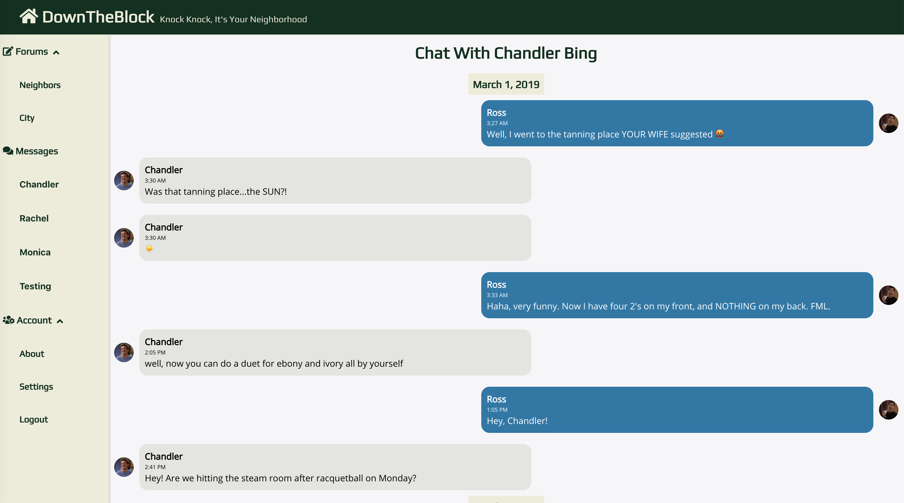

# [Down The Block](https://down-the-block.herokuapp.com)

## Welcome to DownTheBlock - Your Neighborhood at Your Fingertips

## Features
:white_check_mark: Users with a registered account will be asked for their geolocation and subsequently connected with their neighborhood

:white_check_mark: Users will be able to see, and post, in two different forums; the neighbors forum has a 1 mile geofence, while the city forum has a 5 mile geofence

:white_check_mark: Users can post, upload pictures, comment, filter, and search the forums in real-time

:white_check_mark: Users can search for and directly message their neighbors within a 1 mile radius for a more private experience

## App Screenshots

### Onboarding

### Forum

### Chats

## Tech Stack: 
Full-stack app with:
- React for the frontend
- Redux for state management
- Node/Express for the backend
- MongoDB for the database hosted on Atlas
- JWTs for authentication
- Socket.io for real-time updates

## Future Updates
:point_right:Send notifications when a user has an unread chat

:point_right: More diverse categories for posts

:point_right: Verify users live in neighborhood

:point_right: Use pagination instead of infinite scroll 

:point_right: Display a map of user’s geofilter

## Links
[Server Repo](https://github.com/thinkful-ei26/Down-The-Block-Server)

[Deployed Server On Heroku](https://down-the-block-server.herokuapp.com/)

[Deployed Client On Heroku](https://down-the-block.herokuapp.com)

[Project Management Trello Link](https://trello.com/b/hPCzbOTZ/neighborhood-watch "trello")

## Demo Info (Friends Edition)
- Demo Account Username: ross

- Demo Account Password: friends123

- Set location to block on browser, and manually put in 15098 Ventura Blvd, Sherman Oaks, CA 91403 into the address form to see the app in action!